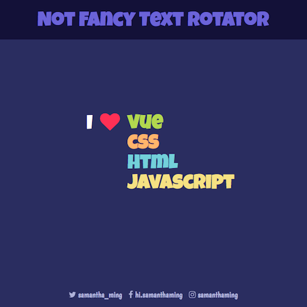

# Not Fancy Text Rotator

A simple, not fancy at all, animated text rotator.

**Features include:**
- The text list rotates every second.
- As the text rotates it's animated using CSS.

**Built using:**
- Vue
- CSS Transition and `@keyframes` Animation
- Google Fonts - Luckiest Guy and Boogaloo

<br>

Play around with it on [CodePen](https://codepen.io/samanthaming/pen/oPOOpe)  
Or see it live! [here](https://samanthaming.github.io/not-fancy-text-rotator/)

<br>



# Notes

Here are the general steps to create your own Not Fancy Text Rotator. Essentially, the CSS provides the animation and JavaScript is used to add or remove the class.

## 1. Setup Rotating Class Name

Alright, let's set up the JavaScript to add and remove the class. This is probably the most tricky part of the entire app. How do we rotate the class on each list item. Well, no worries, we can use `setInterval` 👍

```javascript
mounted() {
  setInterval(() => {
    // 1. Let's look over our list
    this.favorites.forEach(fav => {
      
      // 3. We should reset the number to 0 once it reach the max list
      if(fav.class === this.favorites.length) {
        fav.class = 0;
      }
      
      // 2. We will increment our class number
      fav.class++;
    });
  }, 1000); // 4. The class will change every 1 sec
},
```

And this is how my list of item looks like:

```javascript
data: {
  favorites: [
    {name: 'vue', class: 1},
    {name: 'css', class: 2},
    {name: 'html', class: 3},
  ],
},
```

## 2. Setup Text Placement

Ok, on to the heaving lifting 💪 Next, let's use CSS to place our words. We'll be using absolute positing.

```css
/* Parent */
ul {
  position: relative; 
}
/* Child */
li {
  position: absolute;
}
/* Manually arrange the child */
.w1 {
  top: 0px;
}
.w2 {
  top: 40px;
}
.w3 {
  top: 80px;
}
```

## 3. Create the Rotating Animation Effect

Here is the fun part! Let's create our animation. There are 3 animation that we need to create:

1. The first word needs to have the drop-in effect
2. All the words in between must move 1 level down (except the first one).
3. The last word will slide-off

### 3-1: Drop-in effect

```css
.w1 {
  /* Apply the animation */
  animation-name: drop-in;
  animation-duration: 0.5s;
  
  /* You can also write on one line */
  /* animation: drop-in 0.5s; */
}

@keyframes drop-in {
  0% {
    top: -80px;
    opacity: 0;
  }
  50% {
    opacity: 1;
  }
  100% {
    top: 0;
  }
}
```

### 3-2: Move all words (except 1st) 1 level down

```css
li:not(.w1) {
  transition: top 0.5s;
}
```

### 3-3: Slide-off effect

Very important in this step! Notice I'm using `animation-delay`. This is because I want to slide to appear after the word has move 1 level down. By using the delay, the animation appears to happen one after the other -- or multi-step transition.

```css
.w3 {
  animation-name: slide-off;
  animation-duration: 0.8s;
  animation-delay: 0.8s; /* !!! */
}

@keyframes slide-off {
  100% {
    left: 1000px;
    opacity: 0;
  }
}
```

## 4. Output the HTML

Finally, let's output our list to the HTML and bind our rotating class.

```html
<ul>
  <li v-for="(fav, index) in favorites" 
    :key="index"
    :class="`w${fav.class}`"
  >
    {{ fav.name }}
  </li>
</ul>
```

# Resources

Challenge inspired by [Urbanarium's](https://urbanarium.org/) site.

- [CSS-Tricks: Adding multiple steps to transitions](https://css-tricks.com/using-multi-step-animations-transitions/#article-header-id-4)
- [w3schools: CSS animation-fill-mode](https://www.w3schools.com/cssref/css3_pr_animation-fill-mode.asp)

# Join the #NotFancyAppChallenge

This is part of they #NotFancyAppChallenge. It's all about learning by doing. The only rule, it must be completed within 24hours. Anything more, it’s too fancy 😜 Join me!

More info here ➡️ [Learn more about the challenge](https://github.com/samanthaming/awesome-notfancyappchallenge)
